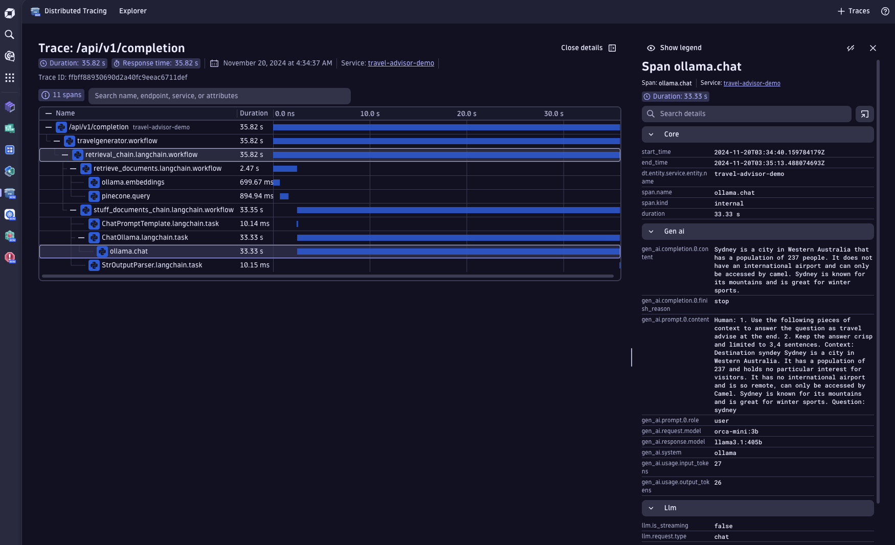

# Visualising Data in Dynatrace

## Uploading the Dashboards
This demo comes with several prebuilt dashboards. Do the following in Dynatrace.

- Save the contents of [dynatrace/dashboards/openai/Travel-Advisor-Overview.json](https://github.com/dynatrace-perfclinics/obslab-llm-observability/blob/main/dynatrace/dashboards/openai/Travel-Advisor-Overview.json){target="_blank"}
and [dynatrace/dashboards/ollama-pinecone/[AiObs] Travel-Advisor-Overview.json](https://github.com/Dynatrace/obslab-llm-observability/blob/ollama-pinecone/dynatrace/dashboards/ollama-pinecone/%5BAiObs%5D%20Travel-Advisor-Overview.json) to your computer
- Press  `Ctrl + k` and search for `dashboards` or select the icon from the left toolbar
- Select the `Upload` button and upload the JSON file.

Repeat this process for all the dashboards inside [dynatrace/dashboards/*](https://github.com/dynatrace-perfclinics/obslab-llm-observability/blob/main/dynatrace/dashboards){target="_blank"}

## Distributed Traces

The application emits distributed traces which can be viewed in Dynatrace:

* Press `ctrl + k` search for `distributed traces`
* Traces for `/api/v1/completion` are created for each call to either OpenAI or a call to the Weaviate cache.

Remember that only the very first requests for a given destination will go out to OpenAI. So expect many many more cached traces than "live" traces.

### Trace of the RAG Pipeline

Tracing LangChain allows to see all step that the pipeline takes to supply external knowledge to the LLM model.
In the span attributes, we can observe the prompt crafted by the RAG pipeline with the external documents.

### Trace with OpenAI

A "full" call to OpenAI looks like this. Notice the long call halfway through the trace to `openai.chat`. These traces take much longer (3 seconds vs. 500ms).

### Trace to Weaviate Cache

A call which instead only hits the on-cluster [Weaviate](https://github.com/weaviate/weaviate){target="_blank"} cache looks like this.

Notice that it is much quicker.

The [response TTL](https://github.com/dynatrace-perfclinics/obslab-llm-observability/blob/905b38cf85adaafd87f83ff1f40c640206abdb82/app.py#L29){target="_blank"} (max time that a cached prompt is considered "fresh") is [checked and if the response is "still fresh"](https://github.com/dynatrace-perfclinics/obslab-llm-observability/blob/905b38cf85adaafd87f83ff1f40c640206abdb82/app.py#L119){target="_blank"} (ie. `TTL < stale time`) the cached value is returned.

Notice the cached prompt is `123s`. [The max age (TTL](https://github.com/dynatrace-perfclinics/obslab-llm-observability/blob/905b38cf85adaafd87f83ff1f40c640206abdb82/app.py#L29){target="_blank"} is (by default) `60` minutes. Therefore the prompt is not outdated and thus returned to the user as valid.

## 🎉 Demo Complete

The demo is now complete. Continue to cleanup your environment.

- [Cleanup resources to avoid GitHub charges](cleanup.md)

